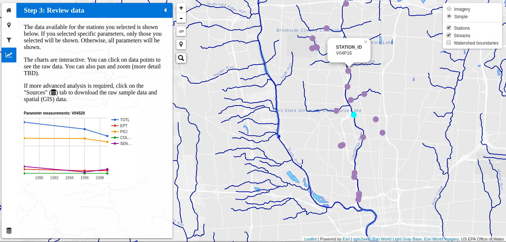

# FLOWWaterQuality

This repository is home to a web application provided by Friends of
the Lower Olentangy Watershed (FLOW) as a tool to browse and visualize
biological and chemical water quality sample data. 

As of November 2016, it is still in the very early stages of
development and is not recommended for use.  Availability on GitHub
does not imply a formal public release.

## Demo

To try out the prototype version of the application, click on the link
below:

[https://adamporr.github.io/FLOWWaterQuality/](https://adamporr.github.io/FLOWWaterQuality/)

## Screenshots

## Usage instructions

Usage instructions are provided in the sidebar of the application

## Compatibility

The application is known to work in the following environments:

  * Linux Mint 17.1 Cinnamon, Chrome 54.0.2840.100 (64-bit), display resolution 1366x768
  * Windows 7, Chrome 54.0.2840.99 (64-bit), display resolution 1366x768

Compatibility with other platforms to be determined.

## Credits

This app relies heavily on free and freely-available software including the following:

  * [Leaflet](http://leafletjs.com/)
  * [Leaflet sidebar-v2 plugin](https://github.com/turbo87/sidebar-v2/)
  * [Leaflet locatecontrol plugin](https://github.com/domoritz/leaflet-locatecontrol)
  * [Leaflet search plugin](https://github.com/stefanocudini/leaflet-search)
  * [Leaflet measurecontrol plugin](https://github.com/makinacorpus/Leaflet.MeasureControl)
  * [Leaflet hash plugin](https://github.com/mlevans/leaflet-hash)
  * [Esri-Leaflet]](https://github.com/Esri/esri-leaflet)
  * [Google Charts](https://developers.google.com/chart/)
  * [Font Awesome](http://fontawesome.io/)
  * [qgis2web](https://github.com/tomchadwin/qgis2web)
  
My heartfelt gratitude goes out to the creators of these excellent tools!

## License

License details to be determined.  Eventually the app will be released under an appropriate open source license that complies with the terms of the included modules.  In the meantime, all rights reserved by Adam Porr except where limited by the terms of use of the included modules. Please contact adam dot porr at gmail with questions.
